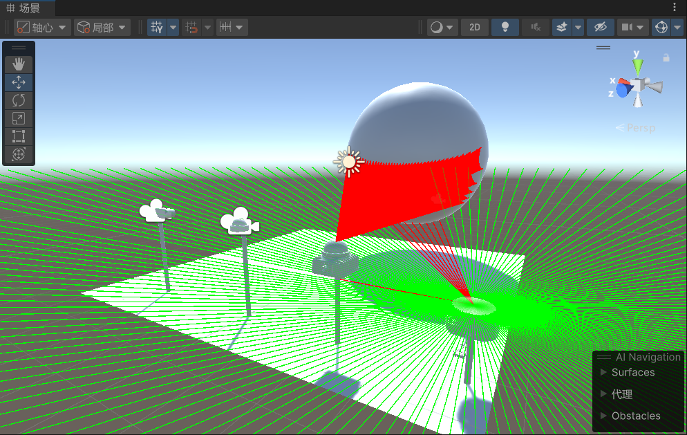
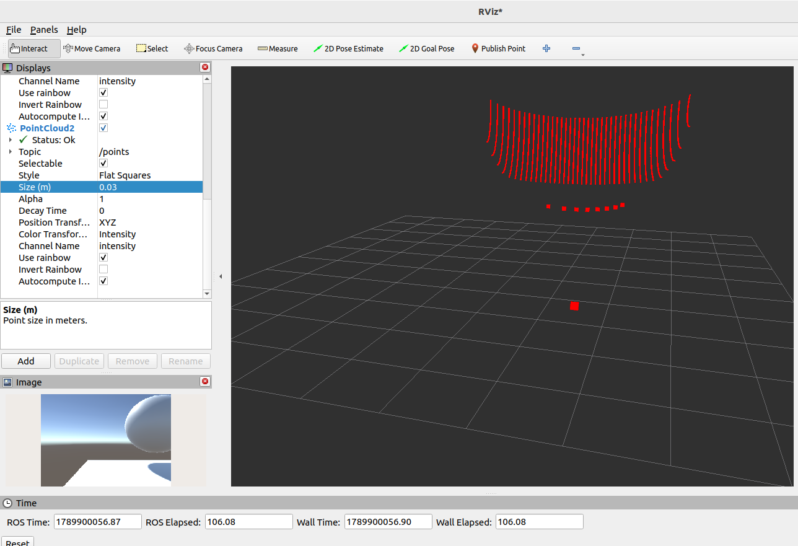
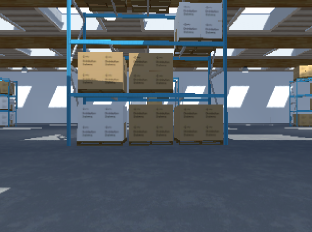
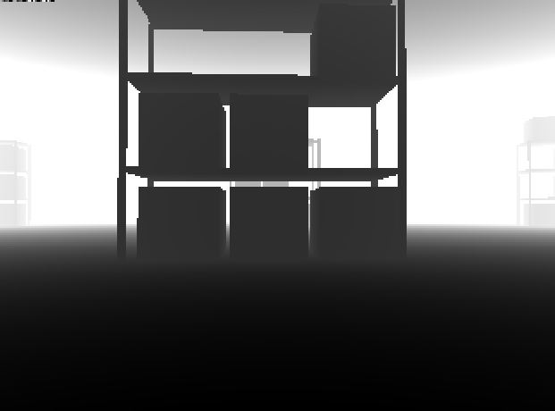
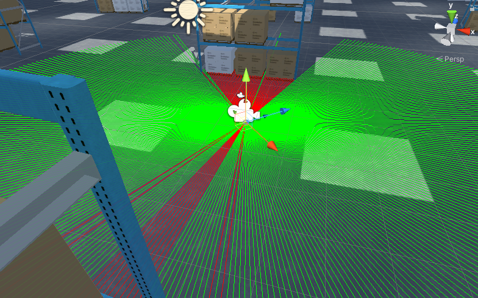
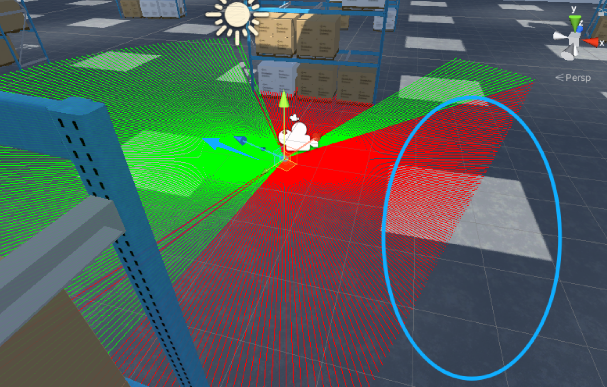
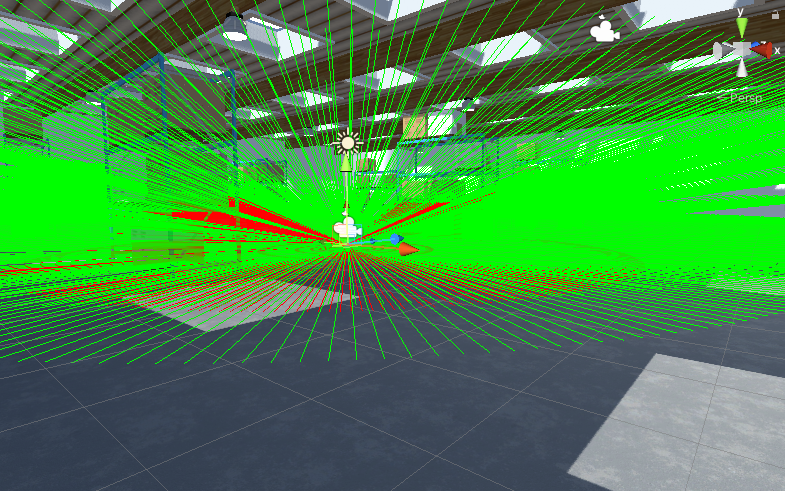

<p align="center">
  <a href="../README.md">简体中文</a> |
  <a href="README_EN.md">English</a> |
  <a href="README_TUTORIAL.md">Bilingual Tutorial</a>
</p>

# ROS Unity Sensors

**Official Release V1.0**

A robot sensor simulation project built with **Unity, ROS-TCP-Connector, and ROS 2**. It provides reusable C# sensor scripts, time and TF utilities, and a complete Unity example project. Sensor data can be published to ROS 2 and visualized in RViz2.

<p align="center">
  
  
</p>

## V1.0 Features

- 2D LiDAR publishing `sensor_msgs/LaserScan`
- 3D LiDAR publishing `sensor_msgs/PointCloud2`
- RGB camera publishing `sensor_msgs/Image`
- RGB-D camera publishing RGB, depth, and `sensor_msgs/CameraInfo`
- Dynamic TF publishers for LiDARs and general scene objects
- Unity simulation time and `/clock` publishing
- A ready-to-open `Unity_sensors` example project
- Sensor models, prefabs, an example scene, and RViz2 screenshots

## Environment

The V1.0 project and tutorial use the following environment:

- Ubuntu 22.04
- ROS 2 Humble
- Unity `2022.3.55f1c1`
- Unity Robotics ROS-TCP-Connector
- Unity Robotics Visualizations
- RViz2

Unity communicates with ROS 2 through ROS-TCP-Connector and ROS-TCP-Endpoint. See the [bilingual setup tutorial](README_TUTORIAL.md) for the complete installation and connection procedure.

## Quick Start

### Open the complete Unity project

1. Open the `Unity_sensors` folder from Unity Hub.
2. Build and start ROS-TCP-Endpoint on Ubuntu.
3. In Unity, open `Robotics > ROS Settings`, enter the Ubuntu/ROS host IP address, and keep port `10000`.
4. Open `Assets/Scenes/SampleScene.unity`.
5. Start RViz2, then enter Play mode in Unity.

### Use the scripts in another Unity project

1. Install ROS-TCP-Connector.
2. Copy the required sensor scripts from `Scripts` into the Unity project's `Assets` folder.
3. If simulation time or TF is required, copy the corresponding files from `auxiliary script`.
4. Attach each script to the appropriate Camera or LiDAR GameObject and configure its topic, Frame ID, publishing rate, and range in the Inspector.
5. Make sure every object that should be detected by a LiDAR or depth camera has a Collider.

## Main Sensors

| Sensor | Script | Default topic | ROS 2 message | Default rate |
| --- | --- | --- | --- | --- |
| RGB Camera | `CameraImagePublisher.cs` | `/camera/image_raw` | `sensor_msgs/Image` | 10 Hz |
| RGB-D Camera | `RGBDCameraPublisher.cs` | `/camera/color/image_raw`, `/camera/depth/image_raw` | `sensor_msgs/Image`, `sensor_msgs/CameraInfo` | 5 Hz |
| 2D LiDAR | `LaserScan2DPublisher.cs` | `/scan` | `sensor_msgs/LaserScan` | 10 Hz |
| 3D LiDAR | `LaserScan3DPublisher.cs` | `/points` | `sensor_msgs/PointCloud2` | 10 Hz |

## RGB Camera

Script: `Scripts/CameraImagePublisher.cs`

Default settings:

- Topic: `/camera/image_raw`
- Frame ID: `camera_link`
- Resolution: `320 × 240`
- Publishing rate: `10 Hz`
- Encoding: `rgb8`

Unity Texture2D data is normally interpreted from the lower-left corner, while ROS image viewers treat the first row as the top of the image. The script performs one vertical flip before publishing so the image appears correctly in ROS 2 and RViz2.

In RViz2, add an `Image` display and select `/camera/image_raw`.



## RGB-D Camera

Script: `Scripts/RGBDCameraPublisher.cs`

Default topics:

- `/camera/color/image_raw`
- `/camera/depth/image_raw`
- `/camera/color/camera_info`
- `/camera/depth/camera_info`

Default settings:

- Frame ID: `camera_link`
- Resolution: `320 × 240`
- Publishing rate: `5 Hz`
- RGB encoding: `rgb8`
- Depth encoding: `32FC1`
- Depth unit: meters
- Minimum/maximum depth: `0.1 m / 20 m`

The depth image is calculated with a Physics.Raycast for each pixel. Scene objects must have Colliders. Increasing the resolution or publishing rate can significantly increase CPU usage.



## 2D LiDAR

Script: `Scripts/LaserScan2DPublisher.cs`

Default settings:

- Topic: `/scan`
- Frame ID: `base_scan`
- Publishing period: `0.1 s`
- Range: `0.12–100 m`
- Scan angle: `0°` to `-359°`
- Measurements per scan: `180`
- `Keep Scan Horizontal`: enabled

When `Keep Scan Horizontal` is enabled, the scan plane follows only the robot's yaw and ignores roll and pitch. This can reduce false ground detections while the vehicle accelerates, brakes, or drives over uneven terrain. When disabled, the scan plane follows the complete robot orientation.





For debug rays, red indicates a hit and green indicates no hit within the maximum range. In RViz2, add a `LaserScan` display and select `/scan`.

## 3D LiDAR

Script: `Scripts/LaserScan3DPublisher.cs`

Default settings:

- Topic: `/points`
- Frame ID: `base_scan`
- Publishing period: `0.1 s`
- Range: `0.1–50 m`
- Horizontal scan: `0°` to `-359°`, `360` samples
- Vertical scan: `-15°` to `15°`, `16` channels
- `Keep Scan Horizontal`: enabled
- Published fields: `x`, `y`, `z`, and `intensity`

Coordinate conversion:

- ROS X = Unity Z
- ROS Y = -Unity X
- ROS Z = Unity Y



In RViz2, add a `PointCloud2` display and select `/points`.

## Auxiliary Scripts

The `auxiliary script` directory contains:

| File | Purpose |
| --- | --- |
| `Clock.cs` | Provides Unity simulation time |
| `TimeStamp.cs` | Converts between Unity time and ROS 2 Time messages |
| `ROSClockPublisher.cs` | Publishes simulation time to `/clock`; only one instance should exist in a scene |
| `Lidar TF Publisher.cs` | Publishes the dynamic transform of a LiDAR relative to the world origin; its Frame IDs and horizontal mode should match the LiDAR script |
| `ROSAbsoluteTransformPublisher.cs` | Publishes the dynamic transform of a selected Transform relative to the Unity world origin |

## ROS 2 Verification Commands

```bash
ros2 topic list
ros2 topic hz /scan
ros2 topic hz /points
ros2 topic hz /camera/image_raw
ros2 topic hz /camera/color/image_raw
ros2 topic hz /camera/depth/image_raw
ros2 topic echo /scan --once
```

## Project Structure

```text
ROS-Unity-Sensors/
├── auxiliary script/       # Time, /clock, and TF utility scripts
├── fig/                    # README and result images
├── Scripts/                # Main sensor scripts
├── Unity_sensors/          # Complete Unity example project
│   ├── Assets/
│   ├── Packages/
│   └── ProjectSettings/
├── docs/
│   ├── README_EN.md        # English README
│   └── README_TUTORIAL.md  # Chinese and English setup tutorial
└── README.md
```

> Do not commit generated Unity folders and files such as `Library`, `Temp`, `Logs`, `obj`, `UserSettings`, `.vs`, `*.csproj`, or `*.sln`. Configure a Unity `.gitignore` before uploading the project.

## Notes

- Topic names and Frame IDs must match the RViz2 configuration, TF tree, and other ROS 2 nodes.
- The 2D LiDAR, 3D LiDAR, and RGB-D depth implementation depend on Physics.Raycast and Colliders.
- More LiDAR rays, a higher RGB-D resolution, and a higher publishing rate increase Unity's computation cost.
- The 3D LiDAR publishes `PointCloud2`, not `LaserScan`.
- When using `/clock`, enable `use_sim_time` for the relevant ROS 2 nodes.

## References

- [Unity ROS-TCP-Connector](https://github.com/Unity-Technologies/ROS-TCP-Connector)
- [Unity ROS-TCP-Endpoint](https://github.com/Unity-Technologies/ROS-TCP-Endpoint)
- [Unity Robotics Nav2 SLAM Example](https://github.com/Unity-Technologies/Robotics-Nav2-SLAM-Example)

## Intended Use

This project is intended for learning, research, and robot simulation development. If it helps you, please consider giving it a Star.
